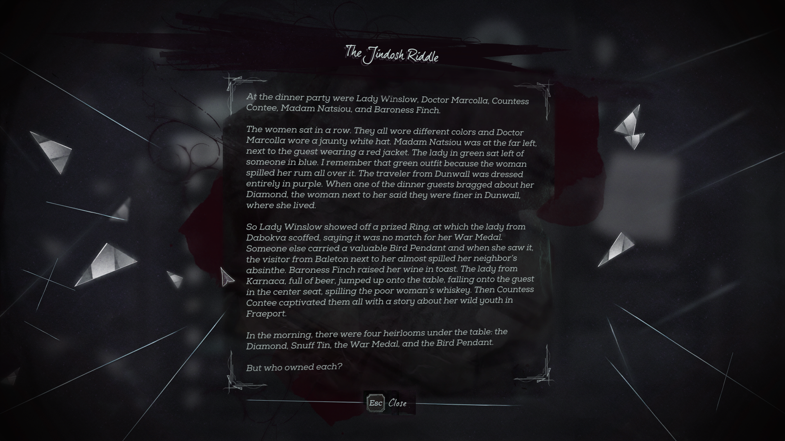


# How I solved Dishonored 2's Jindosh Riddle using linear programming

**Spoiler advice**: This posts (obviously) contains a way how to solve the "Jindosh Riddle" in the video game Dishonored 2. I'm not sure if you consider that a "spoiler", but if you prefer to solve it completely on your own you should probably stop reading now.

Also, if you're not into programming / math, this might be a bit boring. I'll try to keep it understandable! 😊

## Intro
So I recently started mission #6 of Dishonored 2 and faced the "Jindosh Riddle". A locked door behind 5 columns, each column providing a choice of 5 family names and 5 heirlooms. On the right was a note explaining the puzzle. My note looked like this, but from what I read online later, this is randomized for every playthrough.



> The Jindosh Riddle
>
> At the dinner party were Lady Winslow, Doctor Marcolla, Countess
> Contee, Madam Natsiou, and Baroness Finch.
>
> The women sat in a row. They all wore different colors and Doctor
> Marcolla wore a jaunty white hat. Madam Natsiou was at the far left,
> next to the guest wearing a red jacket. The lady in green sat left of
> someone in blue. I remember that green outfit because the woman
> spilled her rum all over it. The traveler from Dunwall was dressed
> entirely in purple. When one of the dinner guests bragged about her
> Diamond, the woman next to her said they were finer in Dunwall,
> where she lived.
>
> So Lady Winslow showed off a prized Ring, at which the lady from
> Dabokva scoffed, saying it was no match for her War Medal.
> Someone else carried a valuable Bird Pendant and when she saw it,
> the visitor from Baleton next to her almost spilled her neighbor's
> absinthe. Baroness Finch raised her wine in toast. The lady from
> Karnaca, full of beer, jumped up onto the table, falling onto the guest
> in the center seat, spilling the poor woman's whiskey. Then Countess
> Contee captivated them all with a story about her wild youth in
> Fraeport.
>
> In the morning, there were four heirlooms under the table: the
> Diamond, Snuff Tin, the War Medal, and the Bird Pendant.
>
> But who owned each?

This sounded like the kind of thing I studied for one semester during my bachelors degrees: <a href="https://en.wikipedia.org/wiki/Linear_programming" target="_blank">Linear programming</a> a method to solve and optimize[^1] a mathematical model. I never had the chance to actually apply what I learned in that course so my nerd brain fired up!

## Approach
Using linear programming to solve such a puzzle doesn't sound so hard, in theory. I, however, haven't done anything like that in years. So I obviously had some ~~problems~~ challenges.

The first step involves finding the magical black box (the "solver") that will transform your problem description to an actual solution. Don't ask me how it does that - it's called "simplex algorithm" but I'm way too stupid to understand it. I no longer have access to the tools I had during university, but luckily there are free alternatives online. I've chosen <a href="https://online-optimizer.appspot.com" target="_blank">this online solver</a>.

The next step involves creating a variable for every single option that might be possible. Stuff like "Is the first seat taken by Lady Winslow?", "Is the second seat taken by Lady Winslow?", "Is the first seat taken by someone who drinks rum?" - and so on. These are quite a lot - 125 to be exact. (5 seat positions, times 5 options, times 5 attributes.) Luckily this is done quite quickly thanks to the support for arrays in the modelling language <a href="https://online-optimizer.appspot.com/doc/gmpl/index.html#SEC_Contents" target="_blank">GNU MathProg</a>:

```
# possible attributes
set poss := { 1 .. 5 }; # starting from the left. I.e. 1 => leftmost, 5 = rightmost
set names := { "winslow", "marcolla", "contee", "natsiou", "finch" };
set heirlooms := { "diamond", "snuff tin", "war medal", "bird pendant", "ring"};
set colors := { "white", "red", "green", "blue", "purple" };
set homes := { "dunwall", "dabokva", "baleton", "karnaca", "fraeport" };
set drinks := { "rum", "absinth", "wine", "beer", "whiskey" };

# create decision variables
# all are binary. 0 = false, 1 = true
var has_name{poss, names} binary;
var has_heirloom{poss, heirlooms} binary;
var has_color{poss, colors} binary;
var has_home{poss, homes} binary;
var has_drink{poss, drinks} binary;
```

Then we need to set up "constraints", mathematical formulas that constrain the variables we just created. The first few are quite easy: Each position has exactly one instance of an attribute set to true, i.e. the sum of all the variables for one attribute must equal to true. The same thing applies the other way round, each attribute is true on only one position. This prevents the solver from giving the same heirloom to everyone or seating multiple people at the same position:

    # each position has exactly one instance of an attribute true
    subject to position_has_name{pos in poss}: sum{name in names} has_name[pos, name] = 1;
    subject to position_has_heirloom{pos in poss}: sum{heirloom in heirlooms} has_heirloom[pos, heirloom] = 1;
    subject to position_has_color{pos in poss}: sum{color in colors} has_color[pos, color] = 1;
    subject to position_has_home{pos in poss}: sum{home in homes} has_home[pos, home] = 1;
    subject to position_has_drink{pos in poss}: sum{drink in drinks} has_drink[pos, drink] = 1;

    # each attribute is true on only one position
    subject to name_has_position{name in names}: sum{pos in poss} has_name[pos, name] = 1;
    subject to heirloom_has_position{heirloom in heirlooms}: sum{pos in poss} has_heirloom[pos, heirloom] = 1;
    subject to color_has_position{color in colors}: sum{pos in poss} has_color[pos, color] = 1;
    subject to home_has_position{home in homes}: sum{pos in poss} has_home[pos, home] = 1;
    subject to drink_has_position{drink in drinks}: sum{pos in poss} has_drink[pos, drink] = 1;

We now get to the constraints from the riddle's text itself. Those directly referring a seat position are still somewhat simple. We just set THAT specific variable to true (i.e. "1"):

    # Madam Natsiou was at the far left, next to the guest wearing a red jacket.
    subject to natsiou_sat_left:
      has_name[1, "natsiou"] = 1;
    subject to second_seat_wore_red:
      has_color[2, "red"] = 1;
    
    # [...] falling onto the guest in the center seat, spilling the poor woman's whiskey.
    subject to center_drank_whiskey:
      has_drink[3, "whiskey"] = 1;

In combination with the rules from above that means that the solver can now infer a "If Madam Natsiou was sitting leftmost, that place can't be used by anyone else now. Also, Madam Natsiou can not sit at any other seat." rule.

Other riddle hints follow a "one attribute causes another attribute" pattern. We can get that to a mathematical constraint by ensuring that either both attributes for a given seat position are true (1), or both are false (0). The math is simply a subtraction: The first attribute minus the second attribute must equal to zero. As both "0 - 0 = 0" and "1 - 1 = 0". This is repeated for every single position (the curly braces in the constraint name) as each position has their own copy of that attribute:

    # Doctor Marcolla wore a jaunty white hat.
    subject to marcolla_wore_white{pos in poss}:
      has_name[pos, "marcolla"] - has_color[pos, "white"] = 0;
    
    # I remember that green outfit because the woman spilled her rum all over it.
    subject to green_drank_rum{pos in poss}:
      has_color[pos, "green"] - has_drink[pos, "rum"] = 0;

    # The traveler from Dunwall was dressed entirely in purple.
    subject to dunwall_wore_purple{pos in poss}:
      has_home[pos, "dunwall"] - has_color[pos, "purple"] = 0;

    # So Lady Winslow showed off a prized Ring, at which the lady from Dabokva scoffed, saying it was no match for her War Medal.
    subject to winslow_has_ring{pos in poss}:
      has_name[pos, "winslow"] - has_heirloom[pos, "ring"] = 0;
    subject to dabokva_has_medal{pos in poss}:
      has_home[pos, "dabokva"] - has_heirloom[pos, "war medal"] = 0;

    # Baroness Finch raised her wine in toast.
    subject to finch_drank_wine{pos in poss}:
      has_name[pos, "finch"] - has_drink[pos, "wine"] = 0;

    # The lady from Karnaca, full of beer, jumped up onto the table, [...]
    subject to karnaca_drank_beer{pos in poss}:
      has_home[pos, "karnaca"] - has_drink[pos, "beer"] = 0;

    # Then Countess Contee captivated them all with a story about her wild youth in Fraeport.
    subject to contee_from_fraeport{pos in poss}:
      has_name[pos, "contee"] - has_home[pos, "fraeport"] = 0;

The next kind of constraint is already quite difficult as it takes into account the position relative to another: "The lady in green sat left of someone in blue." It took me some [research into a very similar problem](https://pubsonline.informs.org/doi/pdf/10.1287/ited.3.2.55) to figure out, how to write that constraint. By multiplying the position with the attribute value (0/1) and subtracting that with the product of the other attributes value and that position, we get the distance between both seats. Ensure that distance is exactly -1 and the first seat will be directly left of the second one:

    # The lady in green sat left of someone in blue.
    subject to green_sat_left_of_blue:
      sum{pos in poss} ((pos * has_color[pos, "green"]) - (pos * has_color[pos, "blue"])) = -1;

And the final kind of constraint is basically the previous one - just taken a step further: We no longer know if it's the left or the right neighbor. This can only be solved by creating some more variables (pushing the count to 128) which take into account if we use the left or the right side. We can, once again, use the property that any number times zero results in zero, to provide a "but maybe it is the left seat" alternative to the constraints, as 1 - (2 * 1) reduces the right-hand-side to -1 in case for a left-side seat, or keeps it on +1 for a right-side seat:

    # special "helper" decision variables for "next to" constraints
    var dunwall_right_of_diamond binary; # 1 = right of, 0 = left of
    var baleton_right_of_bird_penant binary; # 1 = right of, 0 = left of
    var absinth_right_of_baleton binary; # 1 = right of, 0 = left of

    # When one of the dinner guests bragged about her Diamond, the woman next to her said they were finer in Dunwall, where she lived.
    subject to next_to_diamond_sat_dunwall:
      sum{pos in poss} ((pos * has_heirloom[pos, "diamond"]) - (pos * has_home[pos, "dunwall"])) = 1 - 2 * (dunwall_right_of_diamond);

    # Someone else carried a valuable Bird Pendant and when she saw it, the visitor from Baleton next to her almost spilled her neighbor's absinthe.
    subject to next_to_bird_pendant_sat_baleton:
      sum{pos in poss} ((pos * has_heirloom[pos, "bird pendant"]) - (pos * has_home[pos, "baleton"])) = 1 - 2 * (baleton_right_of_bird_penant);
    subject to next_to_baleton_sat_absinth:
      sum{pos in poss} ((pos * has_home[pos, "baleton"]) - (pos * has_drink[pos, "absinth"])) = 1 - 2 * (absinth_right_of_baleton);

That's it. We're finally done.

## Solution

The solver ran and produced an output. Wohoo -  There actually is a solution to the riddle! However, as there are 128 different variables, the output is quite difficult to read. So I added some code to print only the variables I'm actually interested in, those that evaluated to true. MathProg doesn't have an "if" statement as you'd expect in general programming languages, but we can "cheat" by creating a for-loop (for a set of the single element "0") with a condition:

    for{ pos in poss } {
      printf "Position %d\n", pos;
      
      # Name
      for{ name in names } {
        for {{0}: has_name[pos, name] == 1} { # this is basically an IF
          printf '  %s\n', name;
        }
      }
      
      # Heirloom
      for{ heirloom in heirlooms } {
        for {{0}: has_heirloom[pos, heirloom] == 1} { # this is basically an IF
          printf '  %s\n', heirloom;
        }
      }
      
      # Color
      for{ color in colors } {
        for {{0}: has_color[pos, color] == 1} { # this is basically an IF
          printf '  %s\n', color;
        }
      }
      
      # Home
      for{ home in homes } {
        for {{0}: has_home[pos, home] == 1} { # this is basically an IF
          printf '  %s\n', home;
        }
      }
      
      # Drink
      for{ drink in drinks } {
        for {{0}: has_drink[pos, drink] == 1} { # this is basically an IF
          printf '  %s\n', drink;
        }
      }
      
      printf "\n";
    }

We get our output:

    Position 1
      natsiou
      bird pendant
      purple
      dunwall
      absinth
    Position 2
      finch
      diamond
      red
      baleton
      wine
    Position 3
      marcolla
      war medal
      white
      dabokva
      whiskey
    Position 4
      contee
      snuff tin
      green
      fraeport
      rum
    Position 5
      winslow
      ring
      blue
      karnaca
      beer

Aaaaaand...

<video width="100%" controls>
  <source src="./opening.mp4" type="video/mp4">
  Unfortunately, your browser doesn't support embedded videos.
</video> 

It actually worked! On the first try. This is probably something I never managed during my entire programming career. I feel kinda proud.

## Conclusion
A *huuuuuge* thanks to Arkane Studios. I think adding (and testing) this puzzle, which seems to be generated randomly on every new play-through, is a ton of work. I had very much fun solving this monster and applying skills I'd never use elsewhere. This was something really unique for a video game!

This is the full code for the model:
<script src="https://gist.github.com/Nijin22/a5c2e55f752463fec21c79e94a70d8a8.js"></script>

## Footnotes
[^1]: Optimization doesn't play a role for the Jindosh Riddle, as there is only one valid solution.
